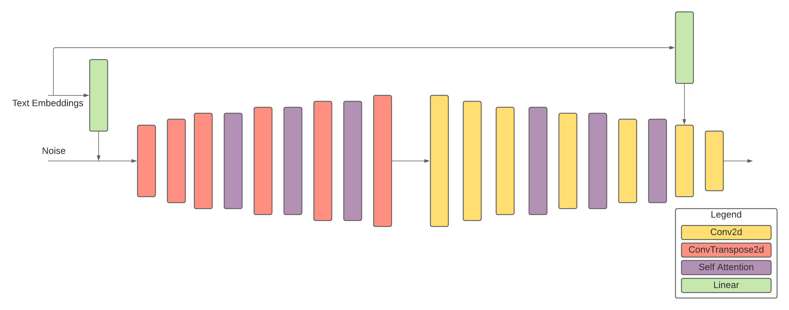

# Self Attention Generative Adversarial Network

Run the colab file - TEXT2FACE-SUPER_RESOLUTION/Face-GANs/SAGAN/N_SelfAttentionGAN.ipynb

The SAGAN has a slightly different architecture as compared to the original architecture. Here, the generator has two fully connected layers with ReLU activations. The text embeddings pass through these layers reducing from vectors of length 768 to 256 and then finally to a vector of length 100 as the output of the final fully connected layer. This vector is then multiplied to the input noise and reshaped to a vector of size (|B|, 100, 1, 1). It passes through layers as stated in the SAGAN paper. For the discriminator, before the second last layer, the text embeddings are passed to a fully connected layer followed by a ReLU activation layer. This is concatenated to the output vectors of the previous layers. The resulting vector is then passed to two convolutional layers after which the output of the final convolutional layer passes through the sigmoid layer, generating outputs ranging from 0 to 1. Images of size 128x128 are generated. For the SAGAN, the learning rates of the generator and discriminator are 0 0001 and 0.0004 respectively. For both the models, the Adam optimizer with 𝛽1 = 0 and 𝛽2 = 0.9 is used.

---

